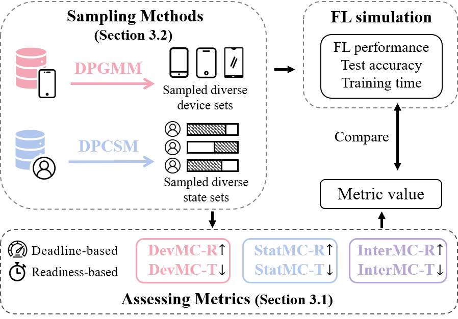
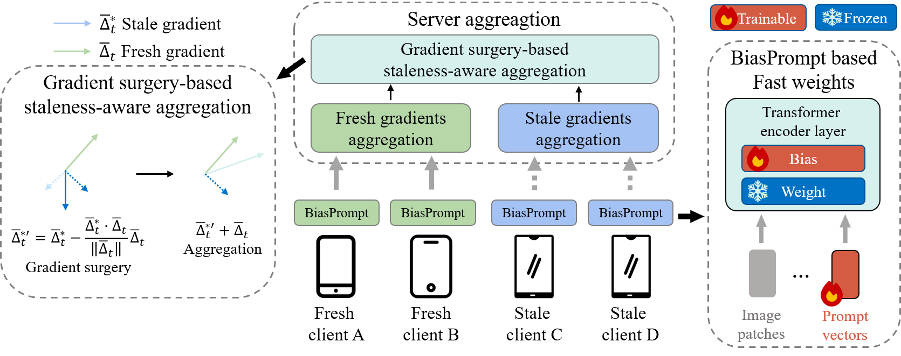

# FLHetBench



- Our FLHetBench consists of 1) two sampling methods, DPGMM for continuous device database and DPCSM for discrete state database, to sample real-world device and state datasets with varying heterogeneity; and 2) various metrics (DevMC-R/T for device heterogeneity, StatMC-R/T for state heterogeneity, and InterMC-R/T for both device and state heterogeneity) to assess the device/state heterogeneity in FL. 

## Overview

- `metric.py` contains the methods for calculating **DevMC-R/T(device heterogeneity), StatMC-R/T(state heterogeneity) and InterMC-R/T(their interplay)**.
- `sampling.py` contains **DPGMM** and **DPCSM**.
- `data/` folder contains all the databases used and the sampled heterogeneous datasets.
- `bench/` folder contains benchmark framework.

## Preliminary

### Installation

```bash
pip install -r requirements.txt
```

### Baseline Real-World Device and State Databases

- Baseline real-world device database (each device is characterized with both computational latency and communication latency) 
  - For communication latency, using [MobiPerf](https://www.measurementlab.net/tests/mobiperf/)
    - `data/mobiperf_tcp_down_2018.json`
    - `data/mobiperf_tcp_down_2019.json`
  - For computational latency, using [AI-Benchmark](https://ai-benchmark.com/) and our proposed training latency data. **Our data will be dynamically updated, and we sincerely invite more people to participate. If you're interested, click on the [link](https://docs.google.com/document/d/1KwNdgW57gNs8VskZwdUGhLg6b_XaplPWdaTRcmbQeWk/edit?usp=sharing) to learn more**
    - `data/device_latency.json`
- dataset for state heterogeneity from [FLASH](https://github.com/PKU-Chengxu/FLASH).
  - `data/cached_timers.json`

### Image Dataset

- OpenImage
  - Download the data partition from [OpenImage](https://drive.google.com/file/d/1ZkNndV-MsMl5fsF3scIy7PNTvotjMtf2/view?usp=sharing)
  - Put the downloaded openImg.npy at sub-folder `bench/data`
- COVID-FL dataset
  - Download the data and partitions file from [COVID-FL](https://drive.google.com/file/d/1BiG30JJ7U2BT0x92DjwfPeLb-uwTHdUV/view?usp=sharing)

## Usage

### 1. Heterogeneity simulation


#### 1.1 Sampling

**TL;DR: For simplicity, you can use the device and state heterogeneity data provided in `bench/cached_sample_data` directly (please refer to [Sec 2.](#2benchmark-your-methods-with-flhetbench)) or build your own heterogeneous environment with DPGMM and DPCSM**

##### 1.1.1 Our sampled device and state data distributions


- Device speed with mild, middle and severe heterogeneity.

##### 1.1.2 Build your own heterogeneous environment with DPGMM and DPCSM 

**DPGMM (Device heterogeneity) can generate device databases with varying heterogeneity degrees while maintaining consistent average speed across the sampled devices by following steps:**

1. Set the average speed of devices `mu` based on your experimental settings.

2. Control heterogeneity using the total number of distinct devices `K` allocated to `n` clients (`K <= n`). A larger value of `K` indicates more distinct samples.

3. Using `sigma` to control the variation of the selected `K` devices. A lager value of `sigma` indicates greater the speed difference between the distinct `K` devices.

Here is an example of sampling 2,466 clients with K_n=50, σ=0.

```python
# network speed infomations refer to 'data/mobiperf_tcp_down_2018.json'
speed_info = json.load(open("data/mobiperf_tcp_down_2018.json", "r"))

# Here is an example of sampling 2,466 clients with K_n=50, σ=0
n = 2466 # number of clients
mu = 4000 # expected average speeed
K = 50 # number of distinct clusters, the same as K_n in the paper
simga = 0. # control of divergence, the same as σ in the paper
random_seed = 42

_, sampled_speed_mean, sampled_speed_std, samples = DPGMM_sampling(speed_info, mu0=mu, K=k, sigma=sigma, n=2466, seed=random_seed)
```

**DPCSM (State heterogeneity) accept two parameters (`start_rank` and `alpha`) can generate state databases with varying heterogeneity levels. DPCSM will first sort the Sort the state data by their scores in `score_dict`. You can control the heterogeneity levels of sampled state data by following steps:**

1. The `start_rank` represent the rank of the optimal state from the baseline dataset, i.e., selecting states $D_{(startRank)}>\cdots>D_{(N)}$ from $D_{(1)}>\cdots>D_{(N)}$ where $D_{(i)}$ indicates the score of state data. A lower `start_rank` indicates a higher score of optimal state.
2. Using `alpha` to control the divergence of sampled state data. A smaller `alpha` leads to a lower probability of selecting subsequent states, concentrating on states with higher score.

```python
# state score dict used for sampling by DPCSM
score_dict = {
    '681': 0.1,
    '573': 0.2,
    ...
}
n = 2466 # number of clients
alpha = 100 # control of divergence, the same as α in the paper
start_rank = 0 # control of start rank, the same as StartRank in the paper

# return a list of length n=2466 with elements that are keys in score_dict
samples = DPCSM_sampling(score_dict, n=2466, alpha=alpha, start_rank=start_rank)
```

#### 1.2 Metric

We use **DevMC-R/T** for assessing device heterogeneity. We use **StatMC-R/T** to assess state heterogeneity and **InterMC-R/T** for their interplays.

Please refer to [metric_example.ipynb](metric_example.ipynb) for snippets.

### 2.Benchmark your methods with FLHetBench

In our paper, we used different heterogeneous device and state data from the folder `bench/cached_sample_data` to combine them in pairs to obtain $4\times4=16$ experimental environments for benchmarking. You can easily reproduce our experimental environments as follows.

#### 2.1 Download the Pre-trained Models

- Vision Transformer: download the file from [ViT-B_16](https://drive.google.com/file/d/13DD-dYP3RjMwkYeLYeqdGCXfUBZKEZcQ/view?usp=drive_link) and put it under the sub-folder `bench/checkpoint`

#### 2.2 Run

```bash
# cmd for benchmark
# set aggregation strategy, heterogeneous device data and state data
# Here is a example of benchmarking FedAVG with heterogeneous device data = case1.json and heterogeneous state data = case2.json
python main.py --config configs/default.cfg --aggregation_strategy deadline --device_path cached_sample_data/device/case1.json --state_path cached_sample_data/state/case2.json
```

## Additional Notes

Some important tags for training settings:

- `--dataset_name`: we provide implement of OpenImage and COVID-FL in main.py.
- `--aggregation_strategy`: type of sever aggregation strategy, supports ["deadline", "readiness"].
- `--deadline`: round deadline for deadline-based strategy.
- `--num_rounds`: total communication rounds for deadline-based strategy.
- `--target_acc`: target performance for readiness-based strategy.
- `--device_path`: the sampled heterogeneous device data file path.
- `--state_path`: the sampled heterogeneous state data file path.

## BiasPrompt+



BiasPrompt+ comprises two modules: a gradient surgery-based staleness-aware aggregation strategy (`bench/helpers/gradient_surgery_helper.py`) and a communication-efficient module BiasPrompt (`bench/models/BiasPrompt.py`) based on fast weights.

```bash
# shells for BiasPrompt baseline with cuda:0
bash shells/biasprompt.sh 0
```

## Acknowledgments

- Our code is based on [PKU-Chengxu/FLASH (github.com)](https://github.com/PKU-Chengxu/FLASH)

- ResNet50 and ViT implementations are based on https://github.com/rwightman/pytorch-image-models and [vpt](https://github.com/KMnP/vpt)

